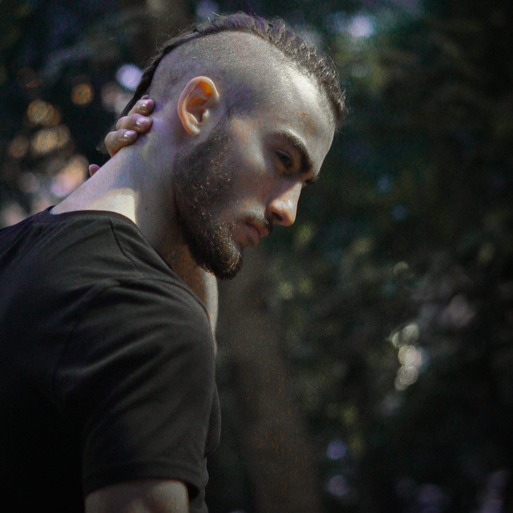

# __Životopis__

## Fotografija

## 1. Osobni podatci
* Matej
* Bucić
* Studiram informacijske tehnologije.
* 17.04.2001.
* Muško
* Hrvatsko

## 2. Kontakt
* mbucic@student.unizd.hr
* 095 518 4573
* Društvene mreže
    * Facebook: Matej Bucić
* Trenutna razmjena poruka
    * WhatsApp: Matej

## 3. Adresa
* Vjekoslava Ficherta 14C
* 23000
* Zadar
* Hrvatska

## 4. Radno iskustvo
* Ne postojeće

## 5. Obrazovanje
### Sveučilište u Zadru - Preddiplomski stručni studij informacijskih tehnologija
* ~~Kvalifikacija~~
* Zadar
* Hrvatska
* U tijeku

### Srednja medicinska škola Ante Kuzmanića - Zadar
* Medicinski tehnićar opće njege
* Zadar
* Hrvatska
* 2015./2016.-2019./2020.

### Osnovna škola Bartula Kašića
* ~~Kvalifikacija~~
* Zadar
* Hrvatska
* 2007./2008.-2014./2015.

## 6. Jezične vještine
### Materinski jezik:
* Hrvatski jezik
### Strani jezik:
* Engleski jezik:
    * Razumijevanje:
        * Slušanje: B1
        * Čitanje: B1
    * Govor:
        * Govorna interakcija: B1
        * Govorna produkcija: B2
    * Pisanje: A2

## 7. Digitalne vještine
Uredsko poslovanje | Osnove programskih jezika | Frontend | Sustavi za verzioniranje i suradnički rad
-- | - | - | -
Word | Python | HTML | Git
Excel | | | GitHub
PowerPoint | | | Google Drive

## 8. Društvene i političke aktivnosti
Nisam aktivan u nikakvim društvenim ili političkim aktivnostima

## 9. Hobiji i interesi
### Sport
Brazilski jiu - jitsu
* Borilačka vještina naizgled hrvanju
* Prakticiram četiri uzastopne godine uz nekolicinu nisko rangiranih natjecanja
### Glazba
Human Beatbox
* Proizvođenje mnoštva zvukova u ritmu imitirajući zabavnu glazbu.
* Dvije godine iskustva
* Dva javna nastupa

## 10. Komunikacijske i međuljudske vještine
Kao zdravstveni djelatnik stekao sam mnoge vještine u razgovoru s ljudima te stjecanju empatije i razumijevanju njihovih problema. Sve navedene vještine su praćene humanitarnim aktivnostima.

## 11. Konferencije, seminari, stručna usavršavanja
Nisam pohađao nikakva stručna usavršavanja, seminare ili konferencije.

## 12. Kreativni radovi
### Beatbox školica
* 2018.-2020.
* Zadar
* Međusobna izmjena znanja i iskustava među beatbox-erima

## 13. Mreže i članstva
### Jiu Jitsu klub Zadar
* 2016.-2020.
* Zadar
* Prakticiranje Brazilskog Jiu Jitsu-a u natjecateljske, zdravstvene i samoobrambene svrhe.

## 14. Organizacijske vještine
Ne posjedujem nikakve organizacijske vještine

## 15. Počasti i nagrade
* Svjedodžba o završenom radu i školovanju
    * Medicinska škola Ante Kuzmanića - Zadar
    * 18.06.2020.
    * Steknuto zanimanje/kvalifikacija

## 16. Preporuke
Bez preporuke

## 17. Projekti
Bez projekta

## 18. Publikacije
[Odlučio sam u Zadru otvoriti prvu školu beatboxa u Hrvatskoj. Naši instrumenti su jezik i usne](https://zadarski.slobodnadalmacija.hr/zadar/zadar-plus/odlucio-sam-u-zadru-otvoriti-prvu-skolu-beatboxa-u-hrvatskoj-nasi-instrumenti-su-jezik-i-usne-570521)
* 17.10.2018.
* Upisao Beatbox školicu u Zadru.

## 19. Vještine/iskustvo upravljanja i rukovođenja
Bez iskustva upravljanja i rukovođenja

## 20. Volontiranje
### Wings for Life World Run
* Zadar
* 08.05.2016.
* Prenošenje zaštitnih ograda i redarenje

## 21. Vozačka dozvola
Ne posjedujem vozačku dozvolu.
